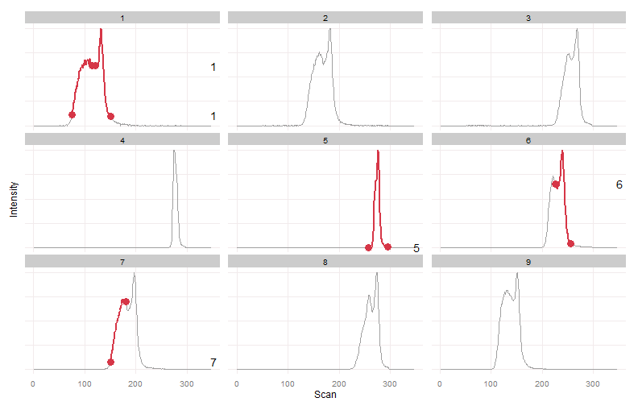
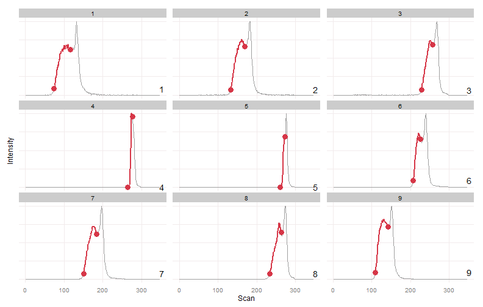
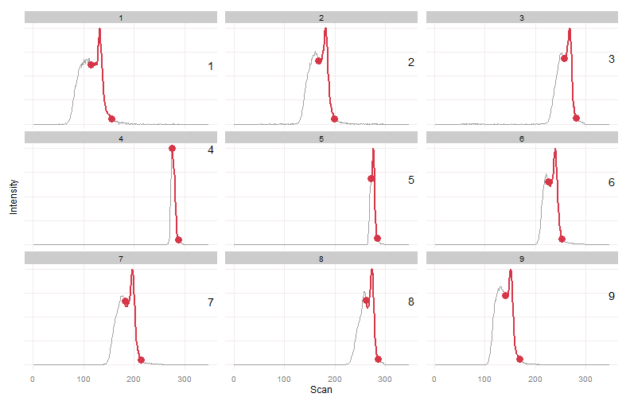

# Warpgroup
Warpgroup is an R package for processing chromatography-mass spectrometry data.  Warpgroup implements:
* Chromatogram subregion detection
* Consensus integration bound determination
* Accurate missing value integration

For more detailed information please see the [publication in Bioinformatics](http://bioinformatics.oxfordjournals.org/content/early/2015/09/29/bioinformatics.btv564.abstract)

## R Package

Warpgroup is available as an R package on GitHub: [nathaniel-mahieu/warpgroup](https://github.com/nathaniel-mahieu/warpgroup)
## Installation
```r
#install.packages("devtools")
devtools::install_github("nathaniel-mahieu/warpgroup")
```

## Usage
```r
library(warpgroup)
warpgroup.bounds = warpgroup(peak.bounds, eic.matrix, sc.aligned.lim = 8)
```

## XCMS Usage
The xcmsSet must include rough grouping information. The quality of resulting warpgroups depends on proper grouping and peak detection.

### Parameters:
* xr.l: a list() containing an xcmsRaw object for each sample in the order of @filepaths
* rt.max.drift: The maximum retention time drift in seconds expected for a peak in the data set in scans.  Used when setting the boundaries for looking for missing peaks.
* ppm.max.drift: The maximum mass drift expected for a peak in the data set in ppm.  Used when setting the boundaries for looking for missing peaks.  Determines how large a region surrounding the group is extracted in order to include any features which were not detected.
* rt.aligned.lim: Peak bounds after alignment are considered to describe the same region if they are within this limit.

```r
# Parallel Backend Setup
library(doParallel)
cl = makeCluster(detectCores() - 1)
registerDoParallel(cl)

#Preprocessing (peak detection, grouping)
xs = xcmsSet(files, ...)
xs.r = retcor(xs, ...)
xs.rg = group(xs.r, ...)

#Warpgrouping
xr.l = llply(xs.rg@filepaths, xcmsRaw, profstep=0)
xs.warpgroup = group.warpgroup(xs.rg, xr.l = xr.l, rt.max.drift = 20, ppm.max.drift = 3, rt.aligned.lim = 5)
```

## Example
Toy data and more examples can be found in the [/inst directory](/inst/warpgroup_examples.md).

This is an extreme example, data this unreliable probably shouldn't be trusted, but it provides a nice challenge and conceptual overview of the algorithm.

```r
data(example_5)

plot_peaks_bounds(eic.mat, peak.bounds)
```



We can clearly see two peaks in most samples.  There is a large retention time drift.  There is also a varying degree of merging between the two peaks.  In some samples two distinct peaks were detected, in others a single peak was detected.


```r
wg.bounds = warpgroup(peak.bounds, eic.mat, sc.max.drift = 0, sc.aligned.lim = 8)

for (g in wg.bounds) print(plot_peaks_bounds(eic.mat, g))
```






Warpgroup generated three peak groups, each group describing a distinct chromatographic region and the same region in each sample.

# License
This project is licensed under the terms of the GPL-3 license.
