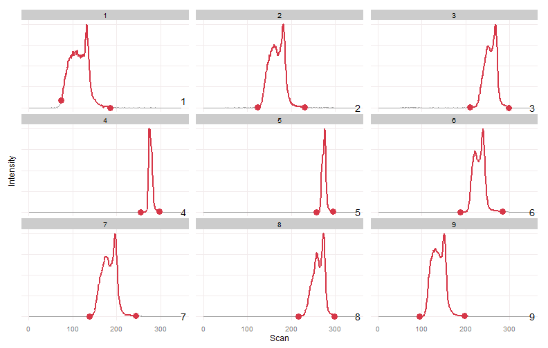

#Warpgroup
Warpgroup is an R package for processing chromatography-mass spectrometry data.  Warpgroup implements:
* Chromatogram subregion detection
* Consensus integration bound determination
* Accurate missing value integration

For more detailed information please see the [publication in Bioinformatics](#)

##R Package

Warpgroup is available as an R package on GitHub: [nathaniel-mahieu/warpgroup](https://github.com/nathaniel-mahieu/warpgroup)
##Installation
````r
#install.packages("devtools")
devtools::install_github("nathaniel-mahieu/warpgroup")
```

##Usage
```r
library(warpgroup)
warpgroup.bounds = warpgroup(peak.bounds, eic.matrix, sc.aligned.lim = 8)
```

##Example
Toy data and more examples can be found in the [/inst directory](/inst).

This is an extreme example, data this unreliable probably shouldn't be trusted, but it provides a nice challenge and conceptual overview of the algorithm.

```r
data(example_5)

plot_peaks_bounds(eic.mat, peak.bounds)
```


We can clearly see two peaks in most samples.  There is a large retention time drift.  There is also a varying degree of merging between the two peaks.  In some samples two distinct peaks were detected, in others a single peak was detected.


```r
wg.bounds = warpgroup(peak.bounds, eic.mat, sc.max.drift = 0, sc.aligned.lim = 8)

for (g in wg.bounds) print(plot_peaks_bounds(eic.mat, g))
```





Warpgroup generated three peak groups, each describing a distinct chromatographic region and the same region between samples.

