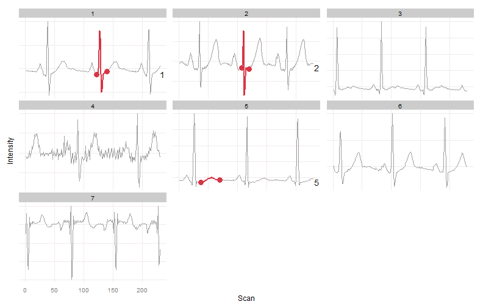
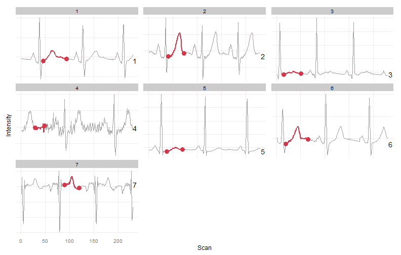
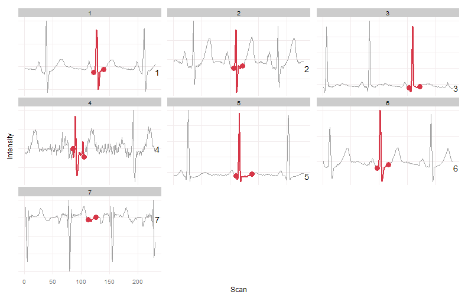

```r
library(warpgroup)
library(ggplot2)
```

# General Time Series Example (EKG)
Warpgroup was developed for LC/MS data but the approach is general and can be applied to any time series data.  As an example we have performed consensus bound determination and intelligent bound filling on the follow echocardiogram data collected from sleep apnea patients.

## Data Sources
ECG data was taken from:

> T Penzel, GB Moody, RG Mark, AL Goldberger, JH Peter. The Apnea-ECG Database. Computers in Cardiology 2000;27:255-258.
> http://www.physionet.org/physiobank/database/apnea-ecg/

## Examples


```r
data(example_ekg)
plot_peaks_bounds(eic.mat.s, ps)
```


We have chosen some regions of the EKGs for this example.  Regions in samples 1 and 2 should produce the same group, and region 5 should be a separate group.  Each group should have missing regions intelligently filled.


```r
wg.bounds = warpgroup(ps, eic.mat.s, sc.aligned.lim = 4)


for (i in seq(wg.bounds)) print(plot_peaks_bounds(eic.mat.s, wg.bounds[[i]]))
```


