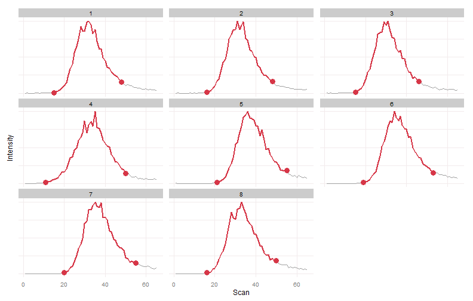
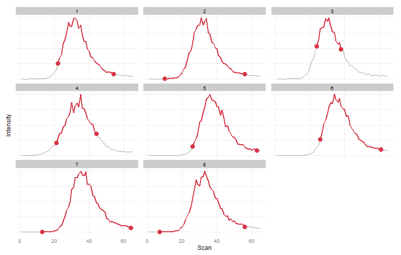
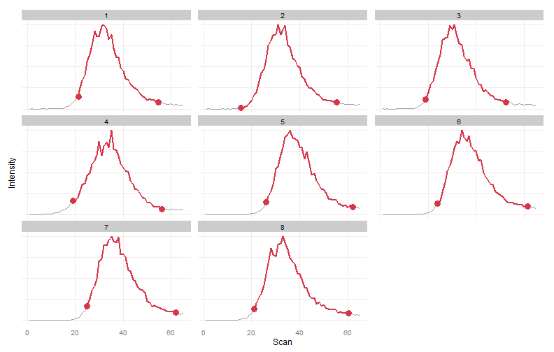
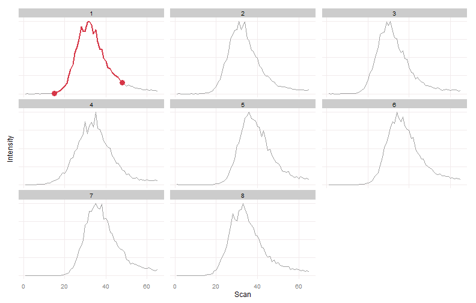
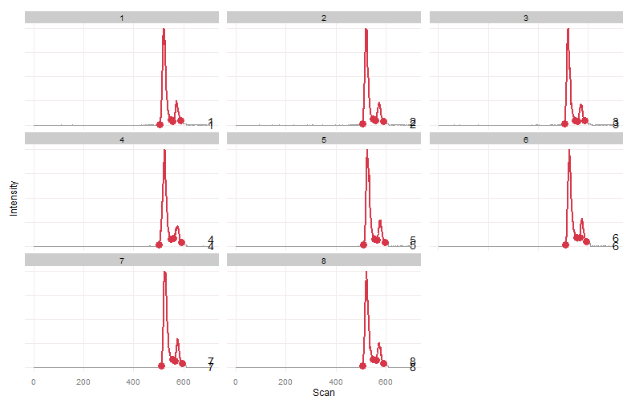
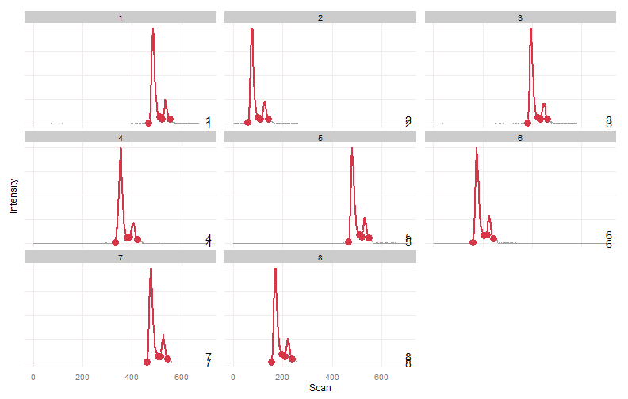
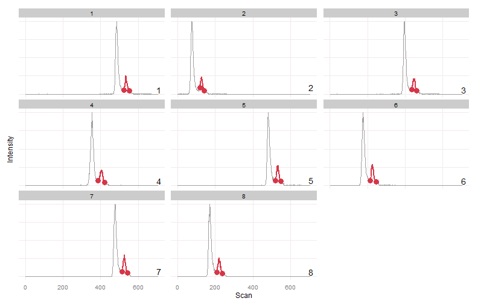
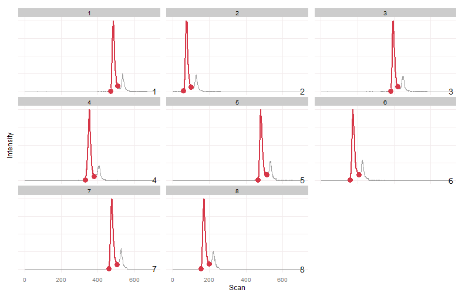

---
title: "Warpgroup Examples"
output: html_document
---

This is a set of example Warpgroup uses, each illustrating a different feature of the algorithm.


```r
library(warpgroup)
library(ggplot2)


ppb2 = function(eic, bounds, overlap = 1.1) {
  eic.mat.s = apply(eic, 2, function(x) { max = max(x); if (max == 0) max = 1; x/max })
  #eic.mat.s = sapply(seq(ncol(eic.mat.s)), function(i) { eic.mat.s[,i]+overlap*(i-1) })
  
  df = melt(eic.mat.s)
  colnames(df) = c("Scan", "Sample", "Intensity")
  
  bounds = cbind(bounds, sample.peak = seq_along(bounds[,1]))
  
  int = array(logical(), dim=dim(eic.mat.s)); int[] = F
  for (r in seq(nrow(bounds))) int[floor(bounds[r,"scmin"]):floor(bounds[r,"scmax"]), bounds[r,"sample"]] = T
  df.int = data.frame(df, Integrated = melt(int)[,3])
  
  df.bounds = melt(data.frame(bounds), id.vars = c("sample.peak", "sample"), measure.vars=c("scmin", "scmax"))
  colnames(df.bounds) = c("sample.peak", "Sample", "Bound", "Scan")
  Intensity = aaply(as.matrix(df.bounds[,c("Sample", "Scan")]), 1, function(x) {
    eic.mat.s[x["Scan"],x["Sample"]]
  })
  df.bounds = cbind(df.bounds, Intensity)
  
  ggplot(df.int, aes(y = Intensity, x = Scan, group=factor(Sample))) + 
    geom_line(data = df.int, colour="#a0a0a0") +
    geom_line(data=subset(df.int, Integrated==T), mapping=aes(group=factor(Sample)), colour="#D63647", size=1) + 
    geom_point(data=df.bounds, colour="#D63647", size=4) +
    geom_text(data = df.bounds[!duplicated(df.bounds[,"sample.peak"]),], mapping = aes(label = Sample), x = max(df.int$Scan)+5) +
    theme(
      axis.text.y=element_blank(),
      axis.ticks=element_blank(),
      legend.position="none",
      panel.background=element_blank(),
      panel.grid.minor=element_blank(),
      panel.grid.major=element_line(colour="#F2EBEC")
    ) + facet_wrap(~Sample, scales="free_y")
}


plot_peaks_bounds = ppb2
```
#Data Format

```r
data(example_1_3)

head(eic.mat)
```

```
##          [,1]     [,2]      [,3]     [,4]     [,5] [,6] [,7] [,8]
## [1,]     0.00     0.00  9305.719 21281.18 11959.37    0    0    0
## [2,] 10862.48 11634.03     0.000 21920.07     0.00    0    0    0
## [3,]     0.00     0.00 12736.042 14096.86     0.00    0    0    0
## [4,]     0.00     0.00     0.000 34584.13     0.00    0    0    0
## [5,]     0.00     0.00     0.000 19327.64     0.00    0    0    0
## [6,] 21487.79     0.00     0.000 40626.04     0.00    0    0    0
```
Extracted Ion Chromatograms representative of the supplied peak bounds are supplied as a matrix, rows representing scans and columns representing samples.


```r
peak.bounds
```

```
##      sc scmin scmax sample
## [1,] 32    15    48      1
## [2,] 33    16    48      2
## [3,] 30    15    46      3
## [4,] 34    11    50      4
## [5,] 37    21    55      5
## [6,] 36    19    53      6
## [7,] 37    20    55      7
## [8,] 33    16    50      8
```
Peak bounds detected in a prerequisite step are supplied as a matrix.  Columns scmin, scmax, and sc are integers refering to rows of the EIC matrix. Column sample refers to the column in the EIC matrix.

#1. Consensus Peak Bound Determination

```r
data(example_1_3)
plot_peaks_bounds(eic.mat, peak.bounds)
```



Our initial EICs and bounds all agree well (they were previously warpgrouped).  Lets add some variance to the peak bounds to simulate real world peak detection.


```r
bad.bounds = aperm(apply(peak.bounds, 1, function(x) {
  x[2] = x[2] + floor(runif(1, 5,11)) * sample(c(-1,1),1)
  x[3] = x[3] + floor(runif(1, 5,11)) * sample(c(-1,1),1)
  x
  }))
plot_peaks_bounds(eic.mat, bad.bounds)
```



We see the peak bounds are not self-consistent, each set of bounds describing a different peak region.  This artifically increases our measurement variance and decreases our statstical power.

Lets see if we can fix this.


```r
wg.bounds = warpgroup(bad.bounds, eic.mat, sc.max.drift = 0, sc.aligned.lim = 6)[[1]]
plot_peaks_bounds(eic.mat, wg.bounds)
```



After submitting the EIC traces and detected peak bounds to warpgrouping we see that all the samples have similar integration regions detected.

#2. Peak Subregion Detection
Still need to find a good example of this

#3. Determination of Undetected Peak Bounds (Fillpeaks)

```r
data(example_1_3)
plot_peaks_bounds(eic.mat, peak.bounds)
```


Again our inital EICs all look good.  Lets delete all the peaks but one and see how warpgroup handles this.


```r
bad.bounds = peak.bounds[1,,drop=F]
plot_peaks_bounds(eic.mat, bad.bounds)
```



We see only one sample had a peak detected in this region. Traditionally a large, indiscriminate region of the chromatogram is integrated to fill these missing values.  The warpgroup solution follows.


```r
wg.bounds = warpgroup(bad.bounds, eic.mat, sc.max.drift = 0, sc.aligned.lim = 6)[[1]]
plot_peaks_bounds(eic.mat, wg.bounds)
```


After submitting the EIC traces and detected peak bound to warpgrouping we see that all the samples now have similar integration regions.


#4. Grouping Peaks Which Deviate From Global Retention Time Correction

```r
data(example_4)

plot_peaks_bounds(eic.mat, peak.bounds)
```



This time there are two peaks per sample in this rough group.  These have been warpgrouped, but in real life samples each peak's drift will deviate somewhat from the global retention time shift.  Lets add some extreme drift.


```r
eic.mat.bad = array(numeric(), dim=dim(eic.mat))
peak.bounds.bad = peak.bounds

for (r in seq(ncol(eic.mat))) {
  shift = floor(runif(1,0,470))
  eic.mat.bad[,r] = c(
    eic.mat[shift:nrow(eic.mat),r], 
    rep(0,times=shift-1)
    )
  
  peak.bounds.bad[peak.bounds.bad[,"sample"] == r,1:3] = peak.bounds[peak.bounds[,"sample"] == r,1:3] - shift
}

plot_peaks_bounds(eic.mat.bad, peak.bounds.bad)
```



Here is a case that current algorithms would have no chance at grouping. The inter-sample drift is greater than the separation between the peaks to be grouped.  Lets see how warpgrouping does.


```r
wg.bounds = warpgroup(peak.bounds.bad, eic.mat.bad, sc.max.drift = 0, sc.aligned.lim = 6)

for (g in wg.bounds) print(plot_peaks_bounds(eic.mat.bad, g))
```



We see that warpgroup has correctly grouped each peak into the proper, distinct group.

#5. An Extreme Example
This is an extreme example, data this unreliable probably shouldn't be trusted... but it provides a nice challenge.


```r
data(example_5)

plot_peaks_bounds(eic.mat, peak.bounds)
```


We can clearly see two peaks in most samples.  There is a large retention time drift.  There is also a varying degree of merging between the two peaks.  In some samples two distinct peaks were detected, in others a single peak was detected.  Lets see how warpgroup handles this.


```r
wg.bounds = warpgroup(peak.bounds, eic.mat, sc.max.drift = 0, sc.aligned.lim = 8)

for (g in wg.bounds) print(plot_peaks_bounds(eic.mat, g))
```


Warpgroup grouped the peaks into three distinct groups, each describing a different chromatographic region.

